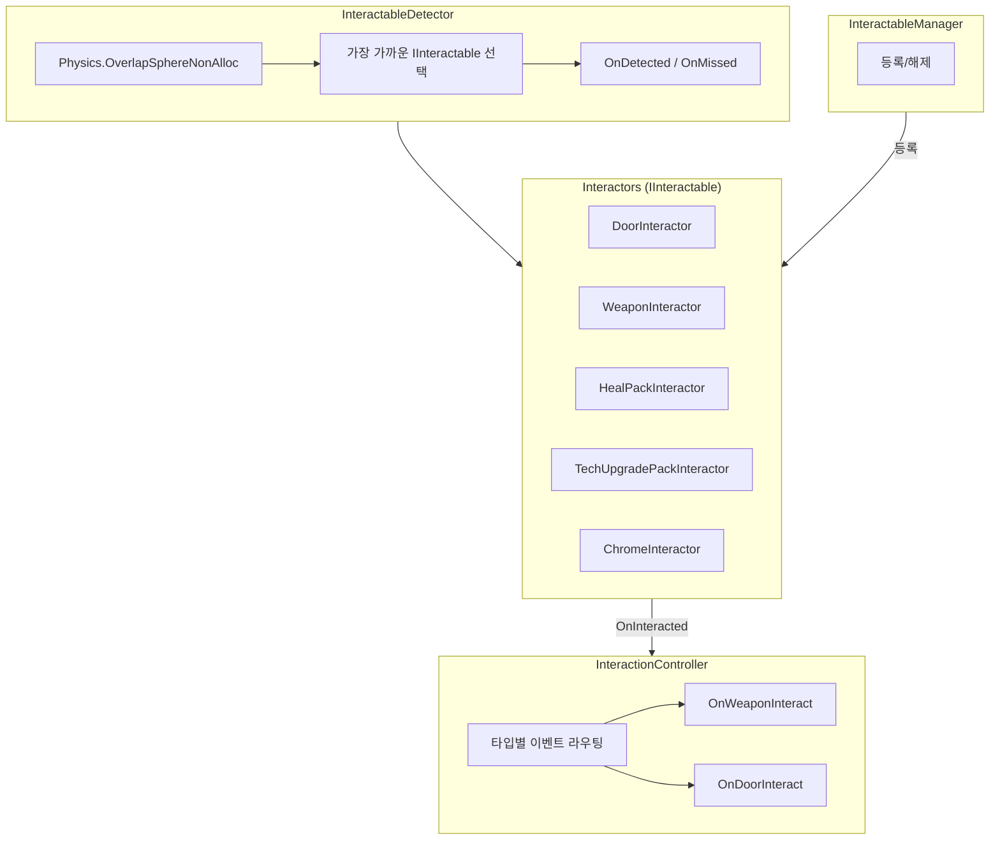
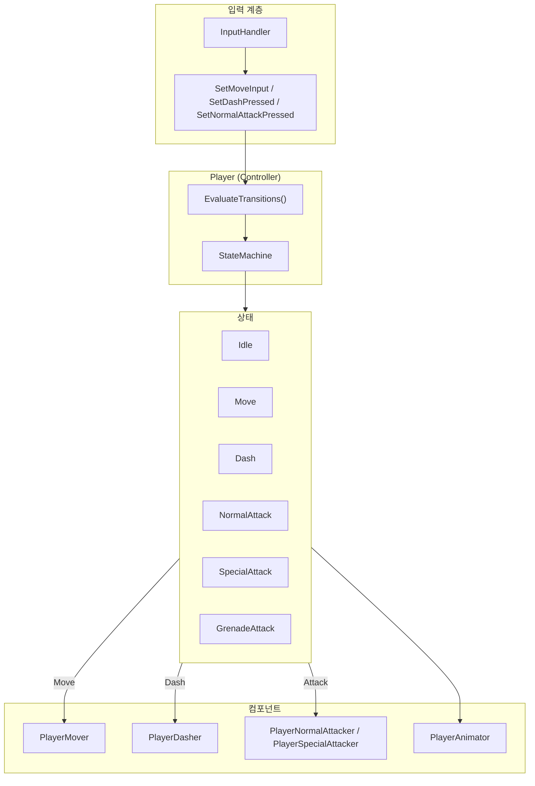
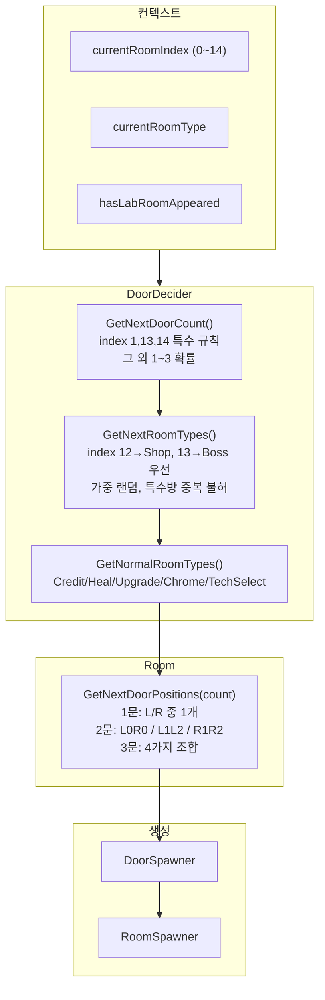
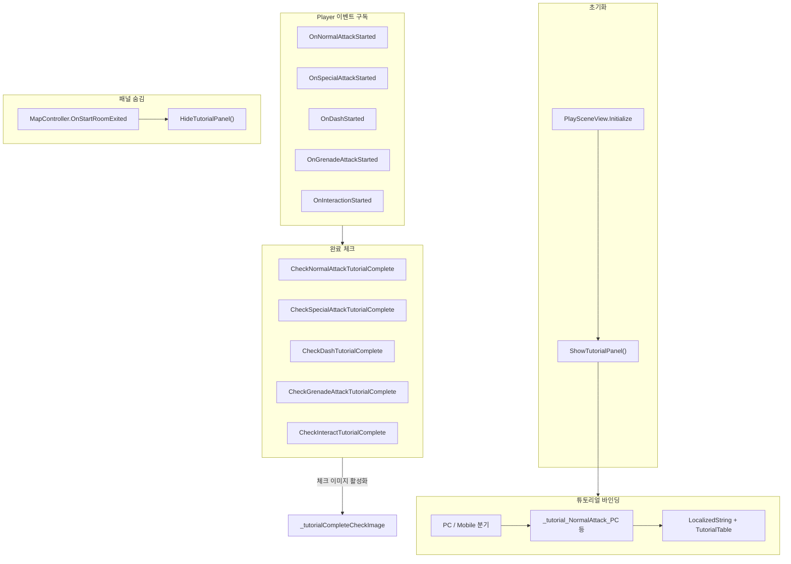
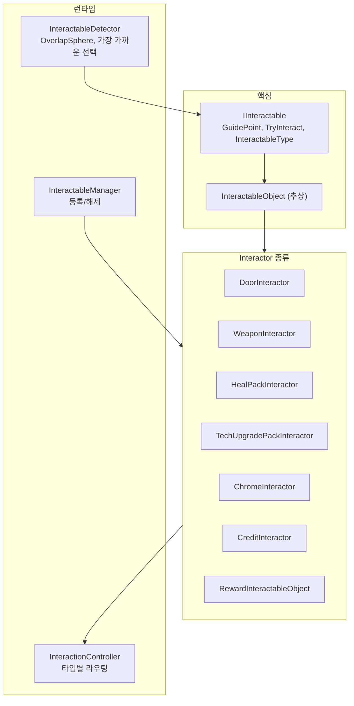
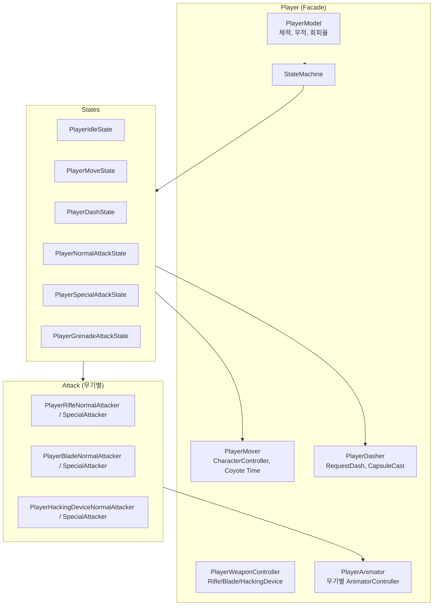
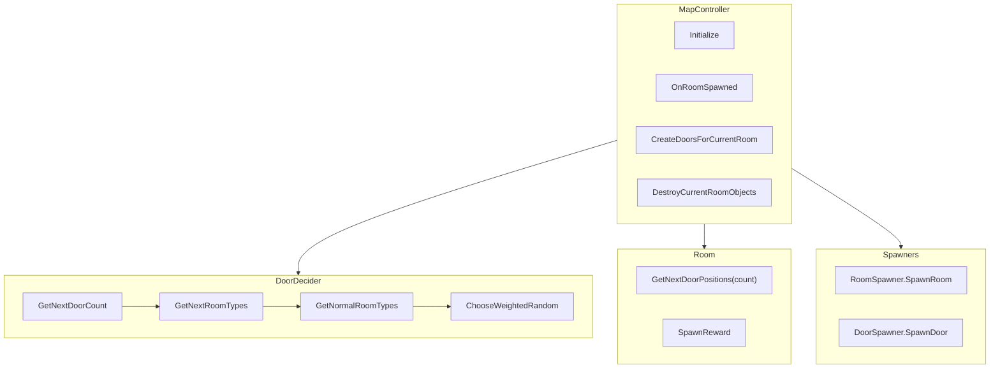

# Project Nemesis

> Unity 기반 3D 액션 로그라이크 슈팅 게임 — 담당 파트 기술 문서

---

## 1. 프로젝트 소개

### 1.1 게임 개요

**Project Nemesis**는 Unity 엔진으로 제작된 **3D 액션 로그라이크 슈팅 게임**입니다.

- **플레이어 시스템**: 이동, 대시, 일반/특수/유탄 공격, 무기 전환
- **상호작용**: 문, 무기, 힐팩, 상점, 기술 업그레이드, 보상 등
- **맵 생성**: 동적 방 생성, DoorDecider 기반 다음 방 선택지 알고리즘
- **튜토리얼**: 시작방에서 액션별 튜토리얼 표시 및 완료 체크
- **스킬 시스템**: 다양한 스킬 획득·강화
- **몬스터 AI**: 일반 몬스터, 엘리트, 보스

**본 문서**는 담당 개발 영역(상호작용, 플레이어, 맵 생성, 튜토리얼)에 대한 기술·포트폴리오 문서입니다.

### 1.2 담당 개발 영역

| 영역 | 담당 범위 |
|------|-----------|
| **상호작용 시스템** | IInteractable 인터페이스, 감지·라우팅, 각종 Interactor 구현 |
| **플레이어 시스템** | 이동, 대시, 상태 머신, 전투 입력, 애니메이션 연동 |
| **맵 생성** | DoorDecider 알고리즘, Room 위치 선택, MapController 흐름 |
| **튜토리얼** | 시작방 튜토리얼 패널, 액션별 완료 체크, PC/Mobile 로컬라이즈 |
| **로컬라이제이션** | 담당 파트(상호작용, 튜토리얼, 방 로딩)의 LocalizedString 바인딩 및 다국어·플랫폼 분기 |

### 1.3 게임 이미지

*(스크린샷은 `Docs/images/` 폴더에 추가 후 테이블을 채울 수 있습니다.)*

### 1.4 영상

*(영상 링크가 있으면 여기에 추가)*

---

## 2. 핵심 기술 항목

### 2.1 상호작용 시스템

#### 도식

| 구분 | 내용 |
|------|------|
| **문제** | 문, 무기, 힐팩, 상점 등 다양한 오브젝트마다 상호작용 로직이 달라 일관된 처리와 확장이 어려움 |
| **해결** | `IInteractable` 인터페이스(GuidePoint, TryInteract, InteractableType)로 통일. `InteractableDetector`가 OverlapSphere로 감지 후 가장 가까운 대상만 선택. `InteractionController`가 OnInteracted 시 타입별로 OnWeaponInteract, OnDoorInteract 등 라우팅 |
| **결과** | 새 Interactor 추가 시 `InteractableObject` 상속 후 TryInteract 구현만 하면 됨. 플레이어·MapController 등 구독자들은 타입별 이벤트만 구독 |

---

### 2.2 플레이어 시스템 (State Machine + Component)

#### 도식

| 구분 | 내용 |
|------|------|
| **문제** | 이동·대시·공격·유탄 등 액션이 많아 입력 우선순위와 상태 전환이 복잡해짐 |
| **해결** | State Machine으로 Idle/Move/Dash/NormalAttack/SpecialAttack/GrenadeAttack 관리. EvaluateTransitions에서 `NormalAttack > Dash > Move > Idle` 우선순위로 단발 입력 소비. Mover, Dasher, Attacker 등은 컴포넌트로 분리해 각 상태에서 호출 |
| **결과** | 입력 충돌 없이 명확한 상태 전환. EventBus.CanGetInput으로 UI·컷신 시 입력 잠금. 스킬 시스템은 DashStarted 등 이벤트만 구독해 연동 |

---

### 2.3 맵 생성 알고리즘 (DoorDecider)

#### 도식

| 구분 | 내용 |
|------|------|
| **문제** | 로그라이크에서 다음 방 선택지는 게임 진행·밸런스에 직결되므로, 규칙이 여러 곳에 흩어지면 수정이 어렵고 버그 발생 |
| **해결** | DoorDecider를 "정책의 단일 진실 원천"으로 두고, MapController는 Decider 결과만 신뢰하고 생성만 담당. GetNextDoorCount(1/13/14 특수 규칙, 그 외 확률), GetNextRoomTypes(Shop/Boss 우선, 가중 랜덤), GetNormalRoomTypes(일반방 세부 타입), Room.GetNextDoorPositions(문 1~3개 위치)로 분리 |
| **결과** | 정책 변경 시 DoorDecider만 수정. MapController는 spawn 흐름에만 집중. 가중치 합 0이면 균등 분포 폴백으로 안전 처리 |

---

### 2.4 튜토리얼 시스템

#### 도식

| 구분 | 내용 |
|------|------|
| **문제** | 신규 유저가 일반공격, 대시, 특수공격, 유탄, 상호작용 등을 배우려면 가이드가 필요하고, PC/Mobile 입력 방식이 달라 플랫폼별 안내 문구가 달라야 함 |
| **해결** | PlaySceneView에서 튜토리얼 패널 표시. LocalizedString + TutorialTable로 `_tutorial_NormalAttack_PC`, `_tutorial_NormalAttack_Mobile` 등 키 바인딩. Player 이벤트(OnNormalAttackStarted, OnDashStarted 등)를 구독해 각 액션 수행 시 해당 체크 이미지 활성화. MapController.OnStartRoomExited 시 HideTutorialPanel 호출로 시작방을 나갈 때 패널 숨김 |
| **결과** | 5가지 액션(일반공격, 유탄, 특수공격, 대시, 상호작용)별 완료 체크. PC/Mobile 로컬라이즈 지원. 시작방 구간에만 표시되어 게임 진행을 방해하지 않음 |

---

## 3. 전체 시스템 아키텍처

### 3.1 상호작용 시스템

**주요 컴포넌트**

| 컴포넌트 | 역할 |
|----------|------|
| IInteractable | GuidePoint, InteractableType, TryInteract(subject), TryGetInteracrtionKey() |
| InteractableObject | 추상 베이스. _guidePoint, 추상 멤버 |
| InteractableDetector | FixedUpdate에서 OverlapSphereNonAlloc, 가장 가까운 IInteractable, OnDetected/OnMissed |
| InteractionController | InteractableManager 구독. OnInteracted 시 Weapon→OnWeaponInteract, Door→OnDoorInteract 등 라우팅 |
| DoorInteractor | RoomInfo 전달, ToggleInteraction, EventBus 입력 잠금 |
| WeaponInteractor | WeaponType 전달 |
| HealPackInteractor, TechUpgradePackInteractor 등 | 각 상호작용 로직 구현 |

---

### 3.2 플레이어 시스템

**주요 컴포넌트**

| 컴포넌트 | 역할 |
|----------|------|
| Player | Controller. EvaluateTransitions, 상태 전환, 컴포넌트 조합, 입력 Setter |
| PlayerModel | 체력, 무적, 전방 무적, 회피율, TakeDamage, Die |
| PlayerMover | Move(direction), Rotate, Coyote Time, Ground Check, PlayerStatManager 연동 |
| PlayerDasher | RequestDash(dir, dist, duration), Interrupt, DashStarted/DashEnded |
| StateMachine | Idle/Move/Dash/NormalAttack/SpecialAttack/GrenadeAttack, TransitionGuard |
| PlayerWeaponController | EquipWeapon, ChangeWeapon, OnWeaponChanged |
| PlayerAnimator | OnMove, OnDash, OnNormalAttack, SetAnimator, GetClipLengthByName |
| PlayerNormalAttacker / PlayerSpecialAttacker | 무기별 RequestAttack, FireNow, DoMeleeHit 등 |

---

### 3.3 맵 생성 시스템

**주요 컴포넌트**

| 컴포넌트 | 역할 |
|----------|------|
| MapController | 룸 생성/파괴, 문 생성, DoorSpawner/DoorDecider/RoomSpawner/MonsterController 조율. GoNextRoomRoutine, CreateDoorsForCurrentRoom |
| DoorDecider | GetNextDoorCount(index), GetNextRoomTypes(count, ...), GetNormalRoomTypes(n), ChooseWeightedRandom. 정책 단일 진실 원천 |
| Room | GetNextDoorPositions(1~3), SpawnReward, MonsterSpawnPoints, PlayerSpawnPoint, DoorSpawnPointsLeft/Right |
| RoomSpawner | RoomInfo → PoolManager.GetFromPool, Room.Initialize, OnRoomSpawned |
| DoorSpawner | Door 생성, RoomInfo 주입 |
| RoomInfo | RoomType, NormalRoomType, TechSelectPackType 등 |

---

### 3.4 튜토리얼 시스템

```mermaid
flowchart TB
    subgraph PlaySceneView["PlaySceneView"]
        ShowPanel["ShowTutorialPanel()"]
        HidePanel["HideTutorialPanel()"]
        BindTutorial["BindTutorialLocalizedString"]
        CheckNA["CheckNormalAttackTutorialComplete"]
        CheckGrenade["CheckGrenadeAttackTutorialComplete"]
        CheckSA["CheckSpecialAttackTutorialComplete"]
        CheckDash["CheckDashTutorialComplete"]
        CheckInteract["CheckInteractTutorialComplete"]
    end

    subgraph Player["Player 이벤트"]
        OnNA["OnNormalAttackStarted"]
        OnGrenade["OnGrenadeAttackStarted"]
        OnSA["OnSpecialAttackStarted"]
        OnDash["OnDashStarted"]
        OnInteract["OnInteractionStarted"]
    end

    subgraph MapController["MapController"]
        OnStartExit["OnStartRoomExited"]
    end

    subgraph Localization["로컬라이제이션"]
        TutorialTable["TutorialTable (ko/en)"]
        Keys["_tutorial_*_PC / _Mobile"]
    end

    ShowPanel --> BindTutorial
    BindTutorial --> TutorialTable
    BindTutorial --> Keys
    OnNA --> CheckNA
    OnGrenade --> CheckGrenade
    OnSA --> CheckSA
    OnDash --> CheckDash
    OnInteract --> CheckInteract
    OnStartExit --> HidePanel
```

**주요 컴포넌트**

| 컴포넌트 | 역할 |
|----------|------|
| PlaySceneView | 튜토리얼 패널 표시/숨김. ShowTutorialPanel, HideTutorialPanel. LocalizedString 바인딩(BindTutorialLocalizedString, UnbindAllTutorialBindings) |
| _tutorialTexts | 튜토리얼 텍스트 리스트 (5개) |
| _tutorialCompleteCheckImage | 액션별 완료 체크 이미지 (0: 일반공격, 1: 유탄, 2: 특수공격, 3: 대시, 4: 상호작용) |
| TutorialTable | Localization Table. _tutorial_NormalAttack_PC/_Mobile, _tutorial_GrenadeAttack_* 등 |
| PlayScene | Player 이벤트 → PlaySceneView.Check*TutorialComplete 연결. MapController.OnStartRoomExited → HideTutorialPanel 연결 |

---

## 4. 부록: 사용 에셋

본 프로젝트에서 사용한 Asset Store 에셋 목록 (일부)

| 에셋 | 사용 용도 |
|------|-----------|
| Robot & Pilot | 캐릭터 모델 |
| Stella Girl, Free Test Character | 캐릭터 모델 |
| MODERN WARFARE | 무기 모델 |
| FX Kandol Pack, Cartoon FX Remaster | 이펙트 |
| Sci-Fi Styled Modular Pack | 맵 에셋 |
| Rolling Balls Sci-fi Pack | 환경 |
| BossOmega | 보스 |
| Japanese Cyberpunk GUI 등 | UI |
| Sci-Fi Small Sound Pack | 사운드 |

---

## 5. 사용 Tool

### 5.1 개발

| Tool | 버전/내용 |
|------|-----------|
| **Unity** | 6000.0.59f2 (Unity 6) |
| **Git** | 버전 관리 |

**주요 패키지**

- Input System 1.14.2
- AI Navigation 2.0.9
- Cinemachine 3.1.4
- Universal RP 17.0.4
- TextMesh Pro
- Addressables
- DOTween

### 5.2 참고

- **프로젝트 노션**: [링크](https://economic-kettle-c2e.notion.site/26fc01e9d6ba80b498dde6d3fc2cc36e)
- **Repository**: https://github.com/TeamNemesis/ProjectNemesis

---

*본 문서는 담당 파트(상호작용, 플레이어, 맵 생성, 튜토리얼)를 기준으로 작성되었습니다.*
