# Project Nemesis

> Unity 기반 3D 액션 로그라이크 슈팅 게임 — 담당 파트 기술 문서

---

## 1. 프로젝트 소개

### 1.1 게임 개요

**Project Nemesis**는 Unity 엔진으로 제작된 **3D 액션 로그라이크 슈팅 게임**입니다.

- **플레이어 시스템**: 이동, 대시, 일반/특수/유탄 공격, 무기 전환
- **맵 생성**: 동적 방 생성, DoorDecider 기반 다음 방 선택지 알고리즘
- **상호작용**: 문, 무기, 힐팩, 상점, 기술 업그레이드, 보상 등
- **엘리트 시점 전환**: Colosseum 진입 시 쿼터뷰→3인칭 전환
- **튜토리얼**: 시작방에서 액션별 튜토리얼 표시 및 완료 체크
- **스킬 시스템**: 다양한 스킬 획득·강화
- **몬스터 AI**: 일반 몬스터, 엘리트, 보스

**본 문서**는 담당 개발 영역(상호작용, 플레이어, 맵 생성, 튜토리얼, 엘리트 시점 전환 등)에 대한 기술·포트폴리오 문서입니다.

### 1.2 담당 개발 영역

| 영역 | 담당 범위 |
|------|-----------|
| **플레이어 시스템** | 이동, 대시, 상태 머신, 전투 입력, 애니메이션 연동, 스탯-UI 바인딩(HP/통화/유탄 등) |
| **맵 생성** | DoorDecider 알고리즘, Room 위치 선택, MapController 흐름, 문 진입 연출(DoorInteractionRoutine) |
| **상호작용 시스템** | IInteractable 인터페이스, 감지·라우팅, 각종 Interactor 구현 |
| **엘리트 전투 시점 전환** | Colosseum(엘리트) 방 진입 시 쿼터뷰→3인칭 시점 전환, Cinemachine, 커서 락, 이동 입력 카메라 기준 변환 |
| **튜토리얼** | 시작방 튜토리얼 패널, 액션별 완료 체크, PC/Mobile 로컬라이즈 |
| **로컬라이제이션** | 담당 파트(상호작용, 튜토리얼, 방 로딩)의 LocalizedString 바인딩 및 다국어·플랫폼 분기 |

### 1.3 게임 이미지

<table>
<tr>
<td><strong>인트로</strong><br>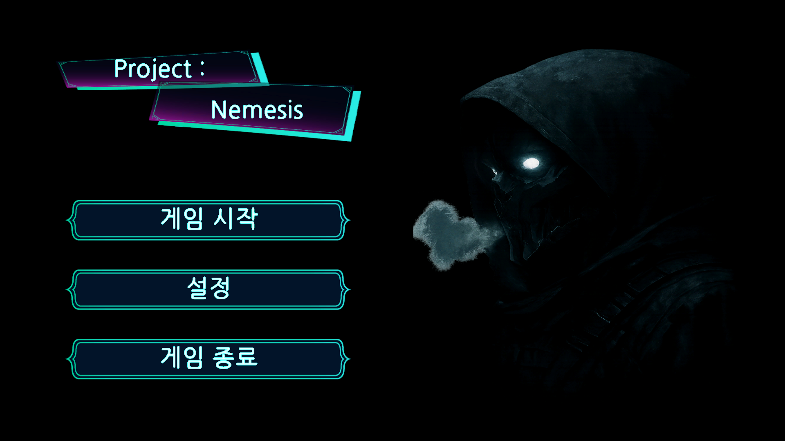</td>
<td><strong>전투 (쿼터뷰)</strong><br>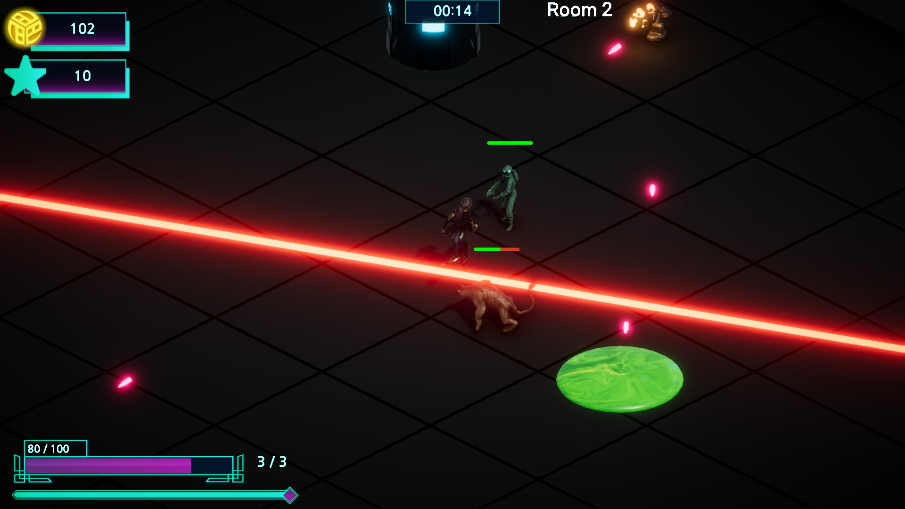</td>
</tr>
<tr>
<td><strong>전투 (콜로세움 3인칭)</strong><br>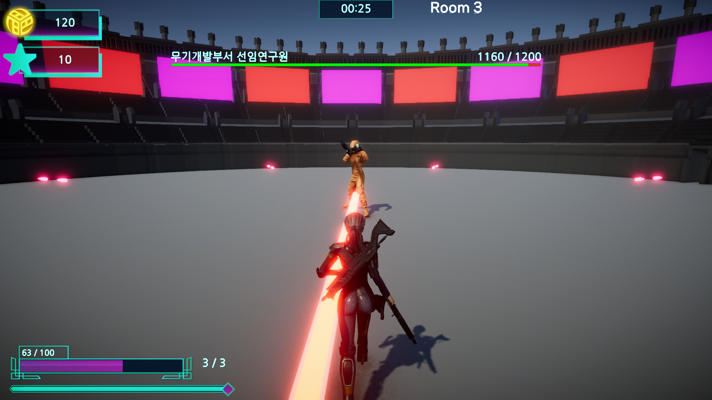</td>
<td><strong>상호작용 UI</strong><br>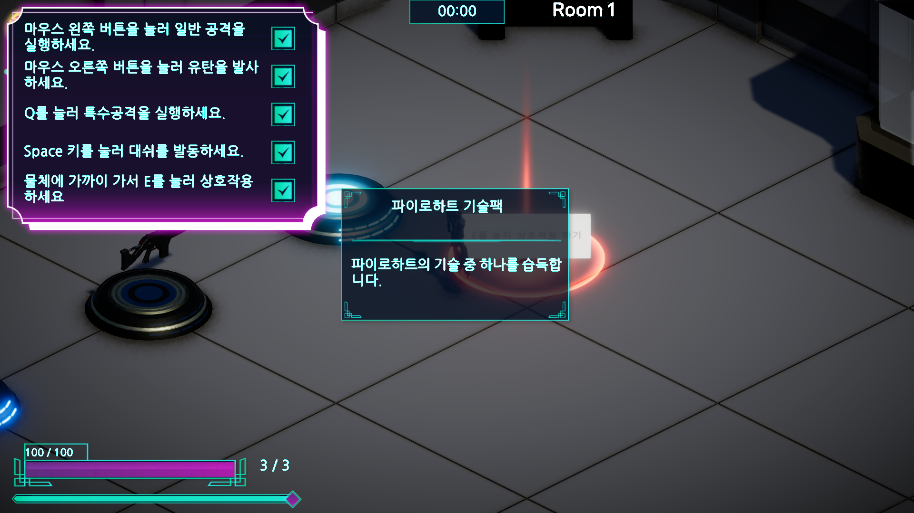</td>
</tr>
<tr>
<td><strong>튜토리얼 (시작)</strong><br>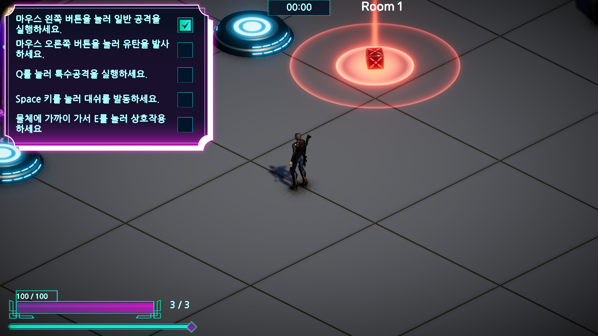</td>
<td><strong>튜토리얼 (완료 체크)</strong><br>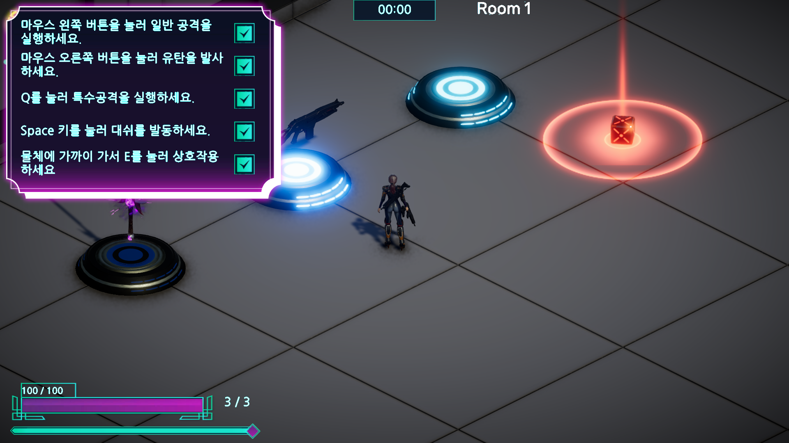</td>
</tr>
<tr>
<td colspan="2"><strong>문 진입 연출</strong><br>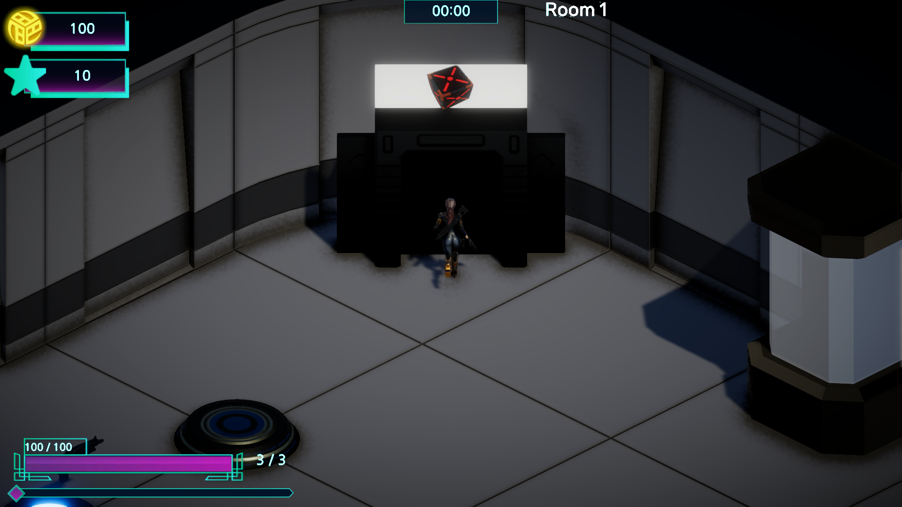</td>
</tr>
</table>

### 1.4 영상

[🎬 영상 보기](https://www.youtube.com/watch?v=AbBBSkmhfGs)

---

## 2. 담당 시스템

### 2.1 플레이어 시스템

| 구분 | 내용 |
|------|------|
| **문제** | 이동·대시·공격·유탄 등 액션이 많아 입력 우선순위와 상태 전환이 복잡해짐 |
| **해결** | State Machine으로 Idle/Move/Dash/NormalAttack/SpecialAttack/GrenadeAttack 관리. EvaluateTransitions에서 `NormalAttack > Dash > Move > Idle` 우선순위로 단발 입력 소비. Mover, Dasher, Attacker 등은 컴포넌트로 분리해 각 상태에서 호출 |
| **결과** | 입력 충돌 없이 명확한 상태 전환. EventBus.CanGetInput으로 UI·컷신 시 입력 잠금. 스킬 시스템은 DashStarted 등 이벤트만 구독해 연동. PlaySceneView가 PlayerModel/CurrencyManager/GrenadeAttacker와 이벤트 구독해 HP바·골드·크롬·유탄 UI 실시간 바인딩 |

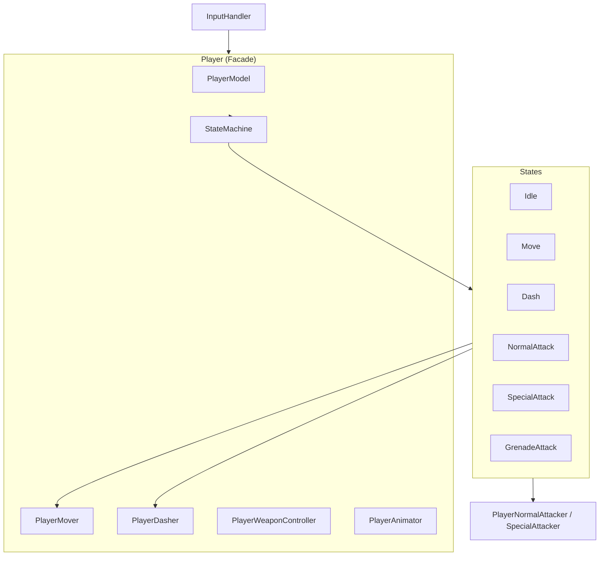

**EvaluateTransitions: 입력 우선순위 처리 (NormalAttack > Dash > Move > Idle)**

```csharp
void EvaluateTransitions()
{
    // 1) 일반 공격 (최우선)
    if (_normalAttackPressed && TryConsumeNormalAttack())
    {
        if (!IsDashing && !_isSpecialAttacking)
        {
            if (_normalAttacker.RequestAttack())
                _stateMachine.ChangeState(PlayerStateType.NormalAttack);
            return;
        }
    }
    // 2) 대시
    if (_dashPressed && TryConsumeDash())
    {
        if (!IsNormalAttacking && !_isSpecialAttacking && !IsDashing)
        {
            _stateMachine.ChangeState(PlayerStateType.Dash);
            return;
        }
    }
    // 3) 이동
    if (_moveInput.sqrMagnitude > 0.01f && !IsNormalAttacking && !_isSpecialAttacking && !IsDashing)
    {
        _stateMachine.ChangeState(PlayerStateType.Move);
        return;
    }
    // 4) Idle
    if (!IsNormalAttacking && !IsDashing && !_isSpecialAttacking)
        _stateMachine.ChangeState(PlayerStateType.Idle);
}
```

**주요 컴포넌트**

| 컴포넌트 | 역할 |
|----------|------|
| Player | Controller. EvaluateTransitions, 상태 전환, 컴포넌트 조합, 입력 Setter |
| PlayerModel | 체력, 무적, 전방 무적, 회피율, TakeDamage, Die |
| PlayerMover | Move(direction), Rotate, Coyote Time, Ground Check, PlayerStatManager 연동 |
| PlayerDasher | RequestDash(dir, dist, duration), Interrupt, DashStarted/DashEnded |
| StateMachine | Idle/Move/Dash/NormalAttack/SpecialAttack/GrenadeAttack, TransitionGuard |
| PlayerWeaponController | EquipWeapon, ChangeWeapon, OnWeaponChanged |
| PlayerAnimator | OnMove, OnDash, OnNormalAttack, SetAnimator, GetClipLengthByName |
| PlayerNormalAttacker / PlayerSpecialAttacker | 무기별 RequestAttack, FireNow, DoMeleeHit 등 |
| PlaySceneView (UI 바인딩) | PlayerModel.OnHpChanged, CurrencyManager, GrenadeCooltime/Count 등 이벤트 구독 → HP바·골드·크롬·유탄 슬라이더 실시간 갱신 |

---

### 2.2 맵 생성 시스템

| 구분 | 내용 |
|------|------|
| **문제** | 로그라이크에서 다음 방 선택지는 게임 진행·밸런스에 직결되므로, 규칙이 여러 곳에 흩어지면 수정이 어렵고 버그 발생 |
| **해결** | DoorDecider를 "정책의 단일 진실 원천"으로 두고, MapController는 Decider 결과만 신뢰하고 생성만 담당. GetNextDoorCount(1/13/14 특수 규칙, 그 외 확률), GetNextRoomTypes(Shop/Boss 우선, 가중 랜덤), GetNormalRoomTypes(일반방 세부 타입), Room.GetNextDoorPositions(문 1~3개 위치)로 분리 |
| **결과** | 정책 변경 시 DoorDecider만 수정. MapController는 spawn 흐름에만 집중. 가중치 합 0이면 균등 분포 폴백으로 안전 처리. 문 상호작용 후 Player.DoorInteractionRoutine(입력 잠금→문 앞 이동→Lerp 진입 연출)으로 전환 감 연출 |

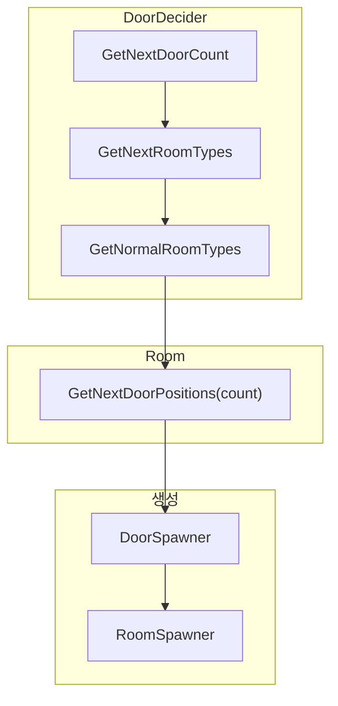

**DoorDecider.GetNextDoorCount: 정책의 단일 진실 원천**

```csharp
public int GetNextDoorCount(int currentRoomIndex)
{
    // 특수 규칙: 시작 방, 보스 직전, 보스 방
    if (currentRoomIndex == 1) return 1;
    if (currentRoomIndex == 13) return 1;
    if (currentRoomIndex == 14) return 0;

    // 그 외: Inspector 설정 확률에 따라 1~3 반환
    float totalChance = _oneDoorChance + _twoDoorChance + _threeDoorChance;
    if (totalChance <= 0f) return UnityEngine.Random.Range(1, 4);

    float rand = UnityEngine.Random.Range(0f, totalChance);
    if (rand < _oneDoorChance) return 1;
    if (rand < _oneDoorChance + _twoDoorChance) return 2;
    return 3;
}
```

**Player.DoorInteractionRoutine: 입력 잠금 → 문 앞 이동 → Lerp 진입 연출**

```csharp
public IEnumerator DoorInteractionRoutine()
{
    EventBus.SetCanGetInput(false);  // 입력 잠금

    // 플레이어를 문 앞으로 이동
    Vector3 targetPos = doorInteractor.transform.position + doorInteractor.transform.forward * 5f;
    targetPos.y = transform.position.y;
    gameObject.SetActive(false);
    transform.position = targetPos;
    gameObject.SetActive(true);

    // Lerp로 문 통과 연출
    float moveDuration = 1.0f;
    Vector3 startPos = transform.position;
    Vector3 endPos = doorInteractor.transform.position;
    float elapsed = 0f;
    while (elapsed < moveDuration)
    {
        elapsed += Time.deltaTime;
        float t = Mathf.Clamp01(elapsed / moveDuration);
        transform.position = Vector3.Lerp(startPos, endPos, t);
        _animator.OnMove(1f);
        yield return null;
    }
    EventBus.SetCanGetInput(true);  // 입력 잠금 해제
}
```

**주요 컴포넌트**

| 컴포넌트 | 역할 |
|----------|------|
| MapController | 룸 생성/파괴, 문 생성, DoorSpawner/DoorDecider/RoomSpawner/MonsterController 조율 |
| DoorDecider | GetNextDoorCount(index), GetNextRoomTypes(count, ...), GetNormalRoomTypes(n), ChooseWeightedRandom. 정책 단일 진실 원천 |
| Room | GetNextDoorPositions(1~3), SpawnReward, MonsterSpawnPoints, PlayerSpawnPoint, DoorSpawnPointsLeft/Right |
| RoomSpawner | RoomInfo → PoolManager.GetFromPool, Room.Initialize, OnRoomSpawned |
| DoorSpawner | Door 생성, RoomInfo 주입 |
| RoomInfo | RoomType, NormalRoomType, TechSelectPackType 등 |
| Player.DoorInteractionRoutine | MapController가 문 상호작용 시 호출. 입력 잠금 → 플레이어 문 앞 이동 → Lerp로 문 통과 연출 → 로딩 패널 연계 |

---

### 2.3 상호작용 시스템

| 구분 | 내용 |
|------|------|
| **문제** | 문, 무기, 힐팩, 상점 등 다양한 오브젝트마다 상호작용 로직이 달라 일관된 처리와 확장이 어려움 |
| **해결** | `IInteractable` 인터페이스(GuidePoint, TryInteract, InteractableType)로 통일. `InteractableDetector`가 OverlapSphere로 감지 후 가장 가까운 대상만 선택. `InteractionController`가 OnInteracted 시 타입별로 OnWeaponInteract, OnDoorInteract 등 라우팅 |
| **결과** | 새 Interactor 추가 시 `InteractableObject` 상속 후 TryInteract 구현만 하면 됨. 플레이어·MapController 등 구독자들은 타입별 이벤트만 구독 |

**IInteractable 인터페이스: 상호작용 대상 통일**

```csharp
public interface IInteractable
{
    Vector3 GuidePoint { get; }
    InteractableType InteractableType { get; }
    event Action<IInteractable> OnInteracted;
    bool TryInteract(Transform subject);
    void TryGetInteracrtionKey(out string title, out string description);
}
```

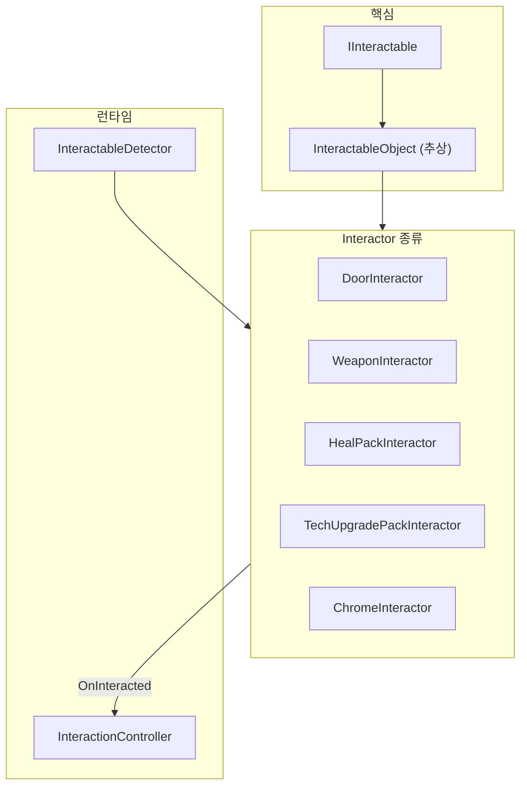

**InteractableDetector.Detect: 가장 가까운 대상만 선택, 변경 시에만 이벤트 발행**

```csharp
// OverlapSphereNonAlloc로 감지 후 가장 가까운 IInteractable만 선택
int hitCount = Physics.OverlapSphereNonAlloc(_detectPoint.position, _radius, _hits, _targetLayerMask);
IInteractable nearestInteractable = null;
float minDistance = float.MaxValue;

for (int i = 0; i < hitCount; i++)
{
    IInteractable interactable = _hits[i].GetComponent<IInteractable>();
    if (interactable != null)
    {
        float distance = Vector3.Distance(_detectPoint.position, _hits[i].transform.position);
        if (distance < minDistance)
        {
            minDistance = distance;
            nearestInteractable = interactable;
        }
    }
}
// 변경 시에만 OnDetected 이벤트 발행
if (nearestInteractable != null && nearestInteractable != _detectedInteractable)
{
    _detectedInteractable = nearestInteractable;
    OnDetected?.Invoke(_detectedInteractable);
}
```

**InteractionController.PublishInteractableEventByType: 타입별 라우팅**

```csharp
void PublishInteractableEventByType(IInteractable interactable)
{
    switch (interactable.InteractableType)
    {
        case InteractableType.Weapon:
            if (interactable is WeaponInteractor w)
                OnWeaponInteract?.Invoke(w.WeaponType);
            break;
        case InteractableType.Door:
            if (interactable is DoorInteractor d && d.RoomInfo != null)
                OnDoorInteract?.Invoke(d.RoomInfo);
            break;
        // HealPack, TechUpgrade, Chrome 등 기타 타입 처리
    }
}
```

**주요 컴포넌트**

| 컴포넌트 | 역할 |
|----------|------|
| IInteractable | GuidePoint, InteractableType, TryInteract(subject), TryGetInteracrtionKey() |
| InteractableObject | 추상 베이스. _guidePoint, 추상 멤버 |
| InteractableDetector | FixedUpdate에서 OverlapSphereNonAlloc, 가장 가까운 IInteractable, OnDetected/OnMissed |
| InteractionController | InteractableManager 구독. OnInteracted 시 Weapon→OnWeaponInteract, Door→OnDoorInteract 등 라우팅 |
| DoorInteractor, WeaponInteractor, HealPackInteractor 등 | 각 상호작용 로직 구현 |

---

### 2.4 엘리트 전투 시점 전환

| 구분 | 내용 |
|------|------|
| **문제** | 일반 방은 쿼터뷰(Orthographic)로 진행하지만, 엘리트(Colosseum) 전투는 더 몰입감 있는 3인칭 시점이 필요함 |
| **해결** | EventBus.SetColosseumRoom으로 Colosseum 진입 시점 전환. 일반 방: CameraMover + Orthographic. 엘리트 방: CinemachineBrain + Perspective. SetMouseCursorLock으로 엘리트 시 커서 잠금·숨김. OnMoveInput에서 Colosseum일 때 카메라 기준 world-space 방향 변환 |
| **결과** | 쿼터뷰와 3인칭 시점을 방 타입에 따라 자동 전환. 엘리트 전투 시 조작감 분리 |

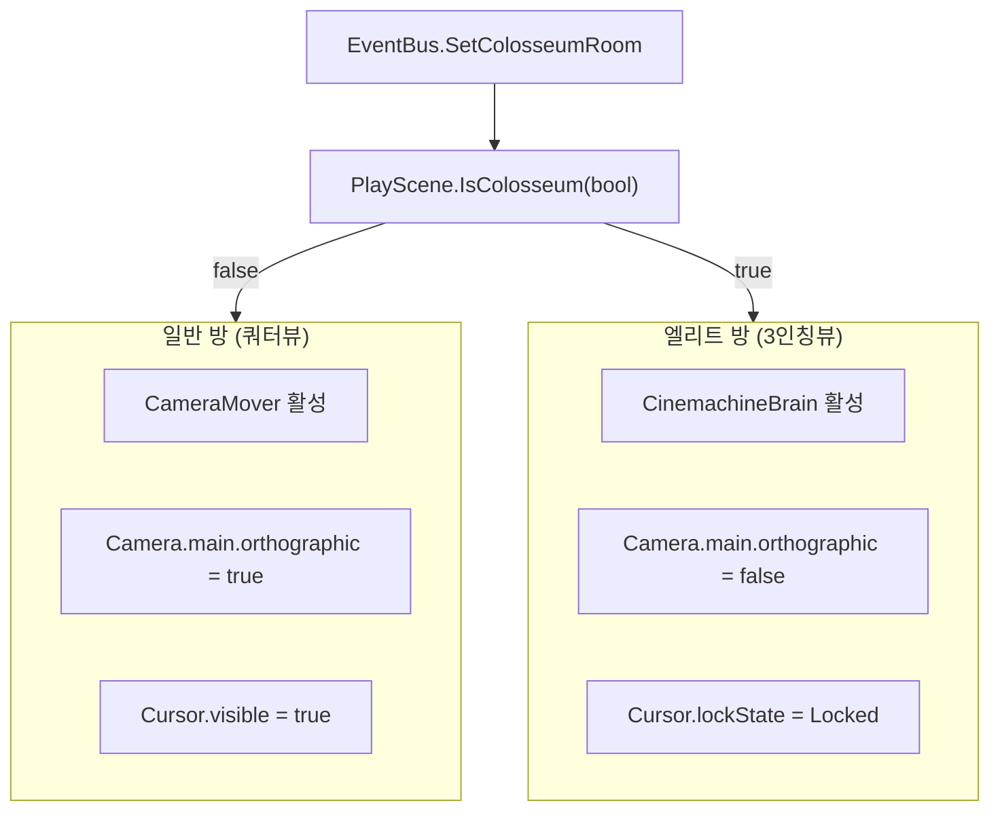

**PlayScene.OnMoveInput: Colosseum 시 카메라 기준 world-space 방향 변환**

```csharp
void OnMoveInput(Vector3 moveDir)
{
    Vector3 moveInput = new Vector3(moveDir.x, 0f, moveDir.z);
    if (!_isColosseumRoom)
    {
        _player.SetMoveInput(moveInput);
        return;
    }
    // Colosseum: 카메라 forward/right 기준으로 world-space 방향 변환
    Camera cam = Camera.main;
    Vector3 camForward = cam.transform.forward;
    Vector3 camRight = cam.transform.right;
    camForward.y = 0f; camRight.y = 0f;
    camForward.Normalize(); camRight.Normalize();

    Vector3 worldDirection = camForward * moveInput.z + camRight * moveInput.x;
    _player.SetMoveInput(worldDirection);
}
```

**주요 컴포넌트**

| 컴포넌트 | 역할 |
|----------|------|
| EventBus | IsColosseumRoom, IsColosseumChanged. MapController가 Colosseum 진입 시 SetColosseumRoom(true) 호출 |
| PlayScene.IsColosseum | EventBus.IsColosseumChanged 구독. CameraMover.enabled = !isColosseum, CinemachineBrain.enabled = isColosseum |
| SetCameraProjection | Colosseum: orthographic=false(Perspective). 일반: orthographic=true |
| SetMouseCursorLock | Colosseum: CursorLockMode.Locked, Cursor.visible=false |
| OnMoveInput | Colosseum일 때 카메라 forward/right 기준으로 world-space 이동 방향 변환 후 Player.SetMoveInput |

---

### 2.5 튜토리얼 시스템

| 구분 | 내용 |
|------|------|
| **문제** | 신규 유저가 일반공격, 대시, 특수공격, 유탄, 상호작용 등을 배우려면 가이드가 필요하고, PC/Mobile 입력 방식이 달라 플랫폼별 안내 문구가 달라야 함 |
| **해결** | PlaySceneView에서 튜토리얼 패널 표시. LocalizedString + TutorialTable로 `_tutorial_NormalAttack_PC`, `_tutorial_NormalAttack_Mobile` 등 키 바인딩. Player 이벤트를 구독해 각 액션 수행 시 해당 체크 이미지 활성화. MapController.OnStartRoomExited 시 HideTutorialPanel 호출 |
| **결과** | 5가지 액션(일반공격, 유탄, 특수공격, 대시, 상호작용)별 완료 체크. PC/Mobile 로컬라이즈 지원. 시작방 구간에만 표시 |

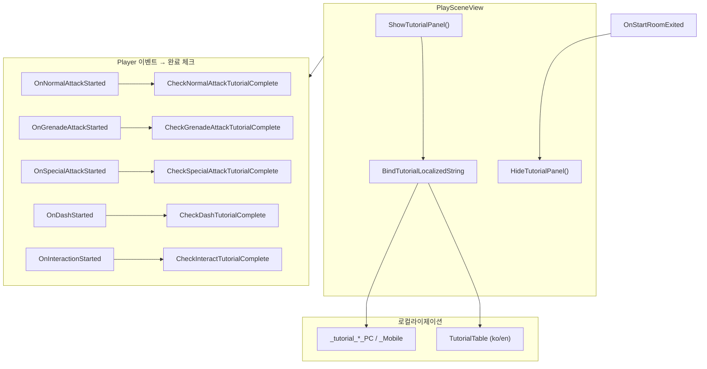

**PlayScene: Player 액션 이벤트 → 튜토리얼 완료 체크 연결**

```csharp
// Player 액션 이벤트를 PlaySceneView 완료 체크에 연결
_player.OnNormalAttackStarted += _playSceneView.CheckNormalAttackTutorialComplete;
_player.OnSpecialAttackStarted += _playSceneView.CheckSpecialAttackTutorialComplete;
_player.OnDashStarted += _playSceneView.CheckDashTutorialComplete;
_player.OnGrenadeAttackStarted += _playSceneView.CheckGrenadeAttackTutorialComplete;
_player.OnInteractionStarted += _playSceneView.CheckInteractTutorialComplete;
_mapController.OnStartRoomExited += _playSceneView.HideTutorialPanel;
```

**주요 컴포넌트**

| 컴포넌트 | 역할 |
|----------|------|
| PlaySceneView | ShowTutorialPanel, HideTutorialPanel. BindTutorialLocalizedString, UnbindAllTutorialBindings |
| _tutorialTexts | 튜토리얼 텍스트 리스트 (5개) |
| _tutorialCompleteCheckImage | 액션별 완료 체크 이미지 (0: 일반공격, 1: 유탄, 2: 특수공격, 3: 대시, 4: 상호작용) |
| TutorialTable | Localization Table. _tutorial_NormalAttack_PC/_Mobile 등 |
| PlayScene | Player 이벤트 → Check*TutorialComplete 연결. OnStartRoomExited → HideTutorialPanel 연결 |

---

## 3. 부록: 사용 에셋

본 프로젝트에서 사용한 Asset Store 에셋 목록 (일부)

| 에셋 | 사용 용도 |
|------|-----------|
| Robot & Pilot | 캐릭터 모델 |
| Stella Girl, Free Test Character | 캐릭터 모델 |
| MODERN WARFARE | 무기 모델 |
| FX Kandol Pack, Cartoon FX Remaster | 이펙트 |
| Sci-Fi Styled Modular Pack | 맵 에셋 |
| Rolling Balls Sci-fi Pack | 환경 |
| BossOmega | 보스 |
| Japanese Cyberpunk GUI 등 | UI |
| Sci-Fi Small Sound Pack | 사운드 |

---

## 4. 사용 Tool

### 4.1 개발

| Tool | 버전/내용 |
|------|-----------|
| **Unity** | 6000.0.59f2 (Unity 6) |
| **Git** | 버전 관리 |

**주요 패키지**

- Input System 1.14.2
- AI Navigation 2.0.9
- Cinemachine 3.1.4
- Universal RP 17.0.4
- TextMesh Pro
- Addressables
- DOTween

### 4.2 참고

- **Repository**: https://github.com/TeamNemesis/ProjectNemesis/tree/feature/player

---

*본 문서는 담당 파트(상호작용, 플레이어, 맵 생성, 튜토리얼, 엘리트 시점 전환 등)를 기준으로 작성되었습니다.*
